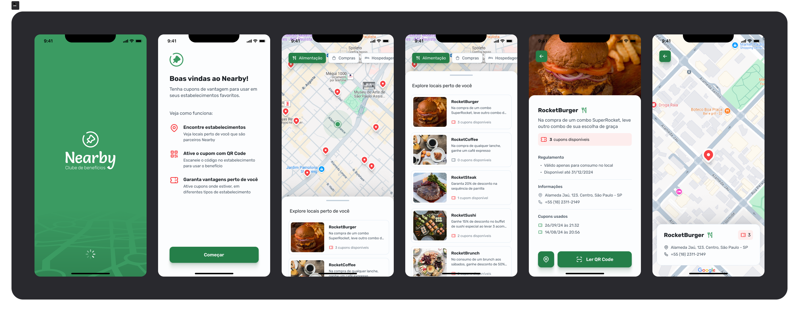

<h1 align="center"> Nearby app</h1>

Nearby app
  

  <a href="#-tecnologias">Tecnologias</a>&nbsp;&nbsp;&nbsp;|&nbsp;&nbsp;&nbsp;
  <a href="#-projeto">Projeto</a>&nbsp;&nbsp;&nbsp;|&nbsp;&nbsp;&nbsp;
  <a href="#-layout">Layout</a>&nbsp;&nbsp;&nbsp;|&nbsp;&nbsp;&nbsp;
  <a href="#memo-licença">Licença</a>

  

 

## 🚀 Tecnologias

Esse projeto foi desenvolvido com as seguintes tecnologias:

- React Native
- Expo
- Typescript
- Axios
- Node
- SQlite
- Prisma
- Zod
- Express

## 💻 Projeto

O projeto é um aplicativo mobile desenvolvido no evento NLW Pocket pela Rocketseat, é um aplicativo  de clube de benefícios com cupons para utilizar em estabelecimentos próximos a você.

## 🎨 Layout
https://www.figma.com/community/file/1448070647757721748

